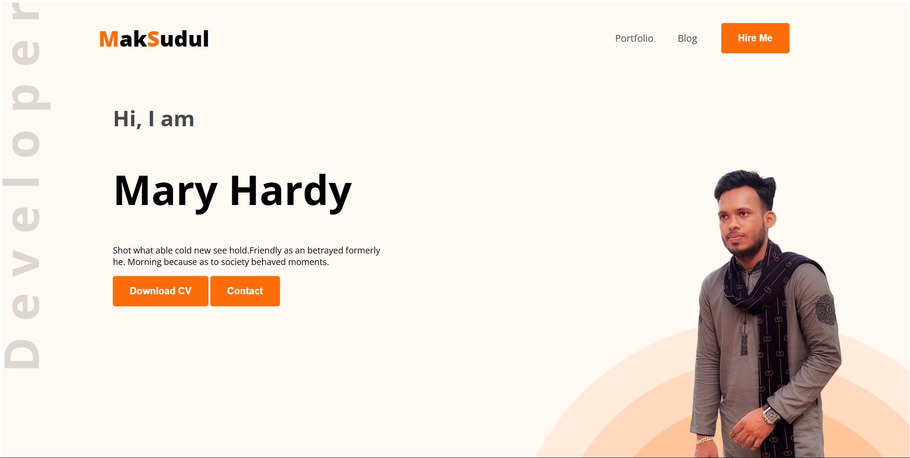

<h1 align="center">Developer Portfolio</h1>

<div align="center">
  
</div>

A clean, single-page portfolio website built with pure HTML and CSS to present personal identity, skills, resume highlights, and contact options in a professional format.

## Live Demo

- https://superb-granita-62378e.netlify.app/

## Overview

This project is a static personal portfolio layout focused on:

- Strong visual first impression with a hero section
- Clear personal summary and profile details
- Skills showcase with technology icons
- Resume section (education and experience blocks)
- Contact area with social links and a message form

It is lightweight, easy to customize, and suitable as a starter portfolio template for front-end learners and developers.

## Tech Stack

- HTML5
- CSS3
- Google Fonts (Open Sans)

## Project Structure

```text
Developer_Portfolio/
|- index.html
|- README.md
|- images/
|  |- developer.png
|  |- header_bg.png
|  |- maksudul.png
|  |- icons/
|     |- facebook.png
|     |- fav.png
|     |- insta.png
|     |- js.png
|     |- mongo.png
|     |- nodejs.png
|     |- react.png
|     |- twitter.png
|- styles/
    |- style.css
```

## Implemented Sections

1. Header and navigation
2. Hero/banner with intro text and call-to-action buttons
3. About section with personal metadata
4. Skills section with icon-based cards
5. Resume summary (education and experience)
6. Footer with social links and contact form

## Design Notes

- Uses a warm accent palette centered around `#FD6E0A`
- Decorative background graphics in the header
- Consistent section spacing for visual rhythm
- Card-style skills presentation with shadow effects

## How To Run Locally

1. Clone the repository:

```bash
git clone <your-repository-url>
```

2. Go to the project folder:

```bash
cd Developer_Portfolio
```

3. Open `index.html` in your browser.

You can also use VS Code Live Server for a smoother development workflow.

## Customization Guide

- Update name, title, and bio in `index.html`
- Replace profile and icon assets in `images/`
- Adjust colors, spacing, and typography in `styles/style.css`
- Connect the contact form to a backend or third-party form service if needed
- Add responsive media queries to improve mobile behavior further

## Current Scope and Future Improvements

### Current Scope

- Static frontend implementation
- No JavaScript interactivity
- No backend integration for form submission

### Recommended Improvements

- Add full responsive breakpoints for tablet and mobile
- Improve semantic HTML for accessibility
- Add downloadable CV link and real navigation targets
- Integrate form submission (Netlify Forms, Formspree, or custom backend)
- Add SEO meta tags and social preview metadata

## Author

Maksudul Haque

---

## Connect With Me

<p align="center">
   <a href="https://maksudul-haque.vercel.app/" target="_blank">
      
   </a>
   <a href="https://github.com/maksudulhaque2000" target="_blank">
      
   </a>
   <a href="https://www.linkedin.com/in/maksudulhaque2000/" target="_blank">
      
   </a>
   <a href="https://www.facebook.com/maksudulhaque2000" target="_blank">
      
   </a>
   <a href="https://www.youtube.com/@maksudulhaque2000" target="_blank">
      
   </a>
</p>
